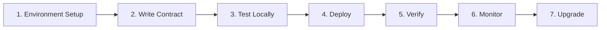

Difficulty: Beginner | Time: ~2 hours (full lifecycle) | Tools: Solidity, Hardhat/Foundry, MetaMask

# Smart Contract Development on XDC

The XDC Network is an EVM-compatible Layer 1 blockchain built for enterprise-grade decentralized applications. With 2-second block times, near-zero gas fees, and deterministic finality, XDC provides an ideal environment for deploying production smart contracts.

This guide covers the complete developer lifecycle:



## Why XDC for Smart Contracts?

| Feature | XDC | Ethereum |
|---------|-----|----------|
| Block time | ~2 seconds | ~12 seconds |
| Gas cost | ~$0.0001 per tx | ~$0.50–$5 per tx |
| Finality | Deterministic (XDPoS 2.0) | Probabilistic |
| EVM compatibility | Full Solidity support | Native |
| Consensus | XDPoS (delegated PoS) | PoS (post-Merge) |
| Enterprise focus | Trade finance, RWA | General purpose |

## What You'll Build

By following this lifecycle guide, you will:

1. Set up a local development environment with Hardhat or Foundry
2. Write and compile a Solidity smart contract
3. Write comprehensive unit tests with 100% coverage
4. Deploy to the XDC Apothem Testnet
5. Verify the source code on XDCScan
6. Monitor contract events and transactions
7. Implement upgradeability with proxy patterns

## Prerequisites

- Basic understanding of Solidity
- Node.js 18+ (for Hardhat) or Rust (for Foundry)
- MetaMask browser extension
- A code editor (VS Code recommended)

## Quick Start — Deploy in 5 Minutes

If you want to deploy immediately without reading the full lifecycle:

=== "Hardhat"

    ```bash
    npx hardhat init
    # Select "Create a TypeScript project"
    # Edit hardhat.config.ts with XDC network settings
    npx hardhat run scripts/deploy.ts --network apothem
    ```

=== "Foundry"

    ```bash
    forge init
    # Edit foundry.toml with XDC RPC endpoints
    forge script script/Counter.s.sol --rpc-url apothem --broadcast
    ```

=== "Remix (Browser)"

    1. Open [remix.xinfin.network](https://remix.xinfin.network/)
    2. Write your contract
    3. Select "Injected Provider — MetaMask"
    4. Click Deploy

For the complete guided experience, continue to [Environment Setup](./setup.md).

## XDC Network Configuration

Use these constants in all your projects:

| Network | Chain ID | RPC URL | Explorer |
|---------|----------|---------|----------|
| Mainnet | 50 | `https://rpc.xinfin.network` | [xdcscan.com](https://xdcscan.com) |
| Apothem Testnet | 51 | `https://rpc.apothem.network` | [testnet.xdcscan.com](https://testnet.xdcscan.com) |
| Devnet | 551 | `https://devnetrpc.xinfin.network` | — |

**Native token:** XDC  
**Address prefix:** `xdc` (XDCScan display) / `0x` (EVM tools)  
**Faucet:** [faucet.apothem.network](https://faucet.apothem.network)  
**Solidity support:** Up to 0.8.24

> 💡 **Address Format Note**  
> XDCScan shows addresses with an `xdc` prefix (e.g., `xdc1234…`). EVM tools like Hardhat, Foundry, and MetaMask use the `0x` prefix (e.g., `0x1234…`). Both refer to the same account — only the prefix differs. All code examples in this guide use `0x` format.

## Developer Lifecycle

### [1. Environment Setup →](./setup.md)
Install Node.js, Hardhat/Foundry, VS Code extensions, and configure MetaMask for XDC.

### [2. Writing Your First Contract →](./writing.md)
Learn Solidity basics, XDC-specific considerations, and write a `Counter` contract.

### [3. Testing Locally →](./testing.md)
Write unit tests, run coverage reports, and test on a local fork.

### [4. Deploy →](./deploy.md)
Deploy to Apothem Testnet using Remix, Hardhat, or Foundry.

### [5. Verify →](./verify.md)
Verify source code on XDCScan automatically or manually.

### [6. Monitor →](./monitoring.md)
Set up event listeners, transaction tracking, and alerts.

### [7. Upgrade →](./upgradeability.md)
Implement proxy patterns for upgradeable contracts.

## Security First

Before deploying to mainnet, review:

- [Security Practices](../security/security-practices.md) — Comprehensive smart contract security guide
- [Vulnerability Catalog](../security/vulnerabilities.md) — Known exploit types and mitigations
- [Audit Preparation](../security/audit-prep.md) — Pre-audit checklist

## Getting Help

- [XDC Developer Discord](https://discord.gg/xdc)
- [XDC Developer Forum](https://www.xdc.dev)
- [GitHub Issues](https://github.com/XinFinOrg/XDPoSChain/issues)

---

**Next Step:** [Environment Setup →](./setup.md)
