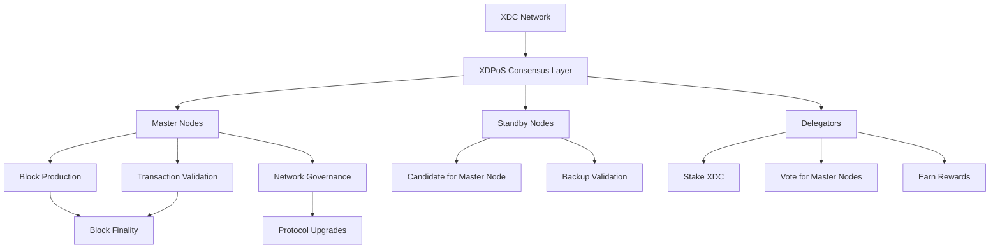

# XDPoS Consensus Mechanism

XinFin Delegated Proof of Stake (XDPoS) is the consensus mechanism powering the XDC Network. It combines the efficiency of Delegated Proof of Stake with enterprise-grade features including Self-KYC compliance, making it suitable for regulated industries and high-throughput applications.

## Architecture Overview



## Validator Selection Process

### Requirements to Become a Master Node

| Requirement | Specification | Purpose |
|-------------|---------------|---------|
| Minimum Stake | 10,000,000 XDC | Economic security and commitment |
| KYC Compliance | Self-KYC via XDC Wallet | Regulatory compliance |
| Hardware | 32GB RAM, 8 cores, 1TB SSD | Reliable block production |
| Uptime | 99.9% availability | Network stability |
| Network | 1 Gbps connection | Fast propagation |

### Selection Algorithm

1. **Stake Weighting**: Candidates ranked by total stake (self-stake + delegations)
2. **KYC Verification**: Must complete on-chain KYC registration
3. **Performance History**: Historical uptime and block production rate considered
4. **Community Voting**: XDC holders vote for preferred validators

```solidity
// Simplified validator selection logic
function selectValidators(uint256 epoch) public view returns (address[] memory) {
    address[] memory candidates = getAllCandidates();
    uint256[] memory scores = new uint256[](candidates.length);
    
    for (uint i = 0; i < candidates.length; i++) {
        // Score = stake * uptime_multiplier * kyc_bonus
        scores[i] = calculateScore(candidates[i]);
    }
    
    return topK(candidates, scores, 108); // Top 108 become master nodes
}
```

## Block Production and Finality

### Epoch-Based Consensus

| Parameter | Value | Description |
|-----------|-------|-------------|
| Block Time | 2 seconds | Time between blocks |
| Epoch Size | 900 blocks | ~30 minutes per epoch |
| Master Nodes | 108 | Active block producers |
| Standby Nodes | Unlimited | Backup validators |

### Block Production Flow

```
Epoch N (Blocks 1-900)
├── Round 1: Validator 1 produces block 1
├── Round 2: Validator 2 produces block 2
├── ...
├── Round 108: Validator 108 produces block 108
├── Round 109: Validator 1 produces block 109
└── ... (continues for 900 blocks)

Epoch N+1 (Blocks 901-1800)
├── New validator set elected
└── Process repeats
```

### Finality Mechanism

XDPoS achieves **instant finality** through a multi-signature scheme:

1. **Block Proposal**: Assigned validator creates and broadcasts block
2. **Verification**: Other validators verify transactions and block validity
3. **Signature Collection**: Validators sign the block header
4. **Finality Threshold**: Block is final when >2/3 validators sign
5. **Irreversibility**: Finalized blocks cannot be reverted

```
Block N (Proposed)
    ↓
Validators Verify
    ↓
Collect Signatures (need 73/108)
    ↓
Block N (Finalized) ← IRREVERSIBLE
```

## Delegation Mechanism

### How Delegation Works

1. **Stake XDC**: Any XDC holder can stake tokens
2. **Choose Validator**: Select one or more master nodes to delegate to
3. **Earn Rewards**: Receive proportional share of block rewards
4. **Unbond Period**: 30-day waiting period for unstaking

### Reward Distribution

```
Total Block Reward = 4.25 XDC per block

Distribution:
├── 40% → Block Producer (Validator)
├── 50% → Delegators (proportional to stake)
└── 10% → Network Treasury

Example:
Validator has 100M XDC total stake
├── 10M self-stake (10%)
└── 90M delegations (90%)

If block reward = 4.25 XDC:
├── Validator gets: 4.25 × 40% = 1.7 XDC
├── Delegators split: 4.25 × 50% = 2.125 XDC
│   └── Delegator with 10M stake gets: 2.125 × (10/90) = 0.236 XDC
└── Treasury: 4.25 × 10% = 0.425 XDC
```

### Delegation Risks

| Risk | Mitigation |
|------|------------|
| Validator Slashing | Choose validators with high uptime |
| Reward Variance | Diversify across multiple validators |
| Lock-up Period | Plan for 30-day unbonding period |
| Validator Exit | Monitor validator performance |

## Comparison with Other PoS Systems

| Feature | XDPoS | Ethereum PoS | Solana | Cosmos Tendermint |
|---------|-------|--------------|--------|-------------------|
| Block Time | 2s | 12s | 400ms | 1-7s |
| Finality | Instant | ~15 min | ~12s | Instant |
| Validators | 108 | ~1M | ~3,400 | 150-300 |
| Min Stake | 10M XDC | 32 ETH | None | Varies |
| KYC Required | Yes | No | No | No |
| Energy Use | Minimal | Minimal | Moderate | Minimal |
| TPS | 2,000+ | 15-30 | 65,000 | 1,000+ |
| Delegation | Yes | Yes | Yes | Yes |
| Slashing | Yes | Yes | Yes | Yes |

### Key Differentiators

**XDPoS Advantages:**
- **Instant Finality**: No reorg risk once block is signed
- **Enterprise Ready**: Built-in KYC for regulated use cases
- **Predictable Costs**: Fixed block time ensures consistent fees
- **High Throughput**: 2,000+ TPS for enterprise applications

**Trade-offs:**
- **Validator Count**: 108 validators vs Ethereum's decentralized pool
- **Stake Requirement**: High minimum stake (10M XDC)
- **KYC Overhead**: Additional compliance step for validators

## Security Model

### Attack Vectors and Defenses

| Attack | Requirement | Defense |
|--------|-------------|---------|
| 51% Attack | Control 55+ validators | KYC makes Sybil expensive |
| Long-range Attack | Historical key compromise | Checkpointing every epoch |
| Nothing-at-Stake | Validator equivocation | Slashing conditions |
| DDoS | Take down validators | Distributed standby pool |

### Slashing Conditions

Validators can be penalized for:

1. **Double Signing**: Signing conflicting blocks at same height
   - Penalty: 100% of stake frozen
   
2. **Downtime**: Missing >25% of blocks in an epoch
   - Penalty: Rewards forfeited for that epoch
   
3. **Invalid Block**: Proposing block with invalid transactions
   - Penalty: Removal from validator set

## XDPoS 2.0 Upgrade

XDPoS 2.0 introduces several enhancements:

| Feature | XDPoS 1.0 | XDPoS 2.0 |
|---------|-----------|-----------|
| Consensus | Delegated PoS | Delegated PoS + BFT |
| Block Time | 2s | 2s |
| Finality | Multi-sig | Optimistic + BFT |
| Validator Set | Fixed 108 | Dynamic up to 108 |
| Reward Model | Fixed | Dynamic based on participation |

### Upgrade Timeline

- **Apothem Testnet**: Live with XDPoS 2.0
- **Mainnet Deployment**: Scheduled via governance vote
- **Backward Compatibility**: Maintained during transition

## Running a Validator Node

### Quick Start

```bash
# 1. Install XDC Client
git clone https://github.com/XinFinOrg/XDPoSChain
cd XDPoSChain
make xdc

# 2. Initialize Node
./build/bin/xdc --datadir /data/xdc init genesis.json

# 3. Start Validator
./build/bin/xdc \
  --datadir /data/xdc \
  --networkid 50 \
  --rpc \
  --rpcaddr 0.0.0.0 \
  --rpcport 8545 \
  --rpcapi eth,net,web3,xdc \
  --mine \
  --unlock $VALIDATOR_ADDRESS
```

### Configuration Requirements

```toml
# config.toml
[Eth]
NetworkId = 50
SyncMode = "full"

[Eth.XDPoS]
Period = 2              # 2 second block time
Epoch = 900             # 900 blocks per epoch
Reward = 4250000000000000000  # 4.25 XDC in wei

[Node]
DataDir = "/data/xdc"
HTTPHost = "0.0.0.0"
HTTPPort = 8545
```

## Monitoring and Metrics

### Key Metrics to Track

| Metric | Target | Alert If |
|--------|--------|----------|
| Block Production Rate | 100% | < 95% |
| Peer Count | > 25 | < 10 |
| Memory Usage | < 80% | > 90% |
| Disk Usage | < 80% | > 90% |
| Network Latency | < 100ms | > 500ms |

### Prometheus Metrics Endpoint

```bash
# Enable metrics
./build/bin/xdc --metrics --metrics.addr 0.0.0.0 --metrics.port 6060

# Query metrics
curl http://localhost:6060/debug/metrics/prometheus
```

## Troubleshooting

| Issue | Cause | Solution |
|-------|-------|----------|
| Not producing blocks | Not in validator set | Check stake and KYC status |
| Slow sync | Network issues | Check peer connections |
| High memory usage | Large state | Enable pruning or increase RAM |
| RPC timeouts | High load | Increase timeout or scale horizontally |

## Further Reading

- [XDPoS White Paper](../whitepaper.md)
- [Validator Setup Guide](./developers/node_operators/masternode.md)
- [Staking Economics](./rewards.md)
- [XDPoS 2.0 Details](./xdpos2.md)
- [Governance Overview](./governance/overview.md)
