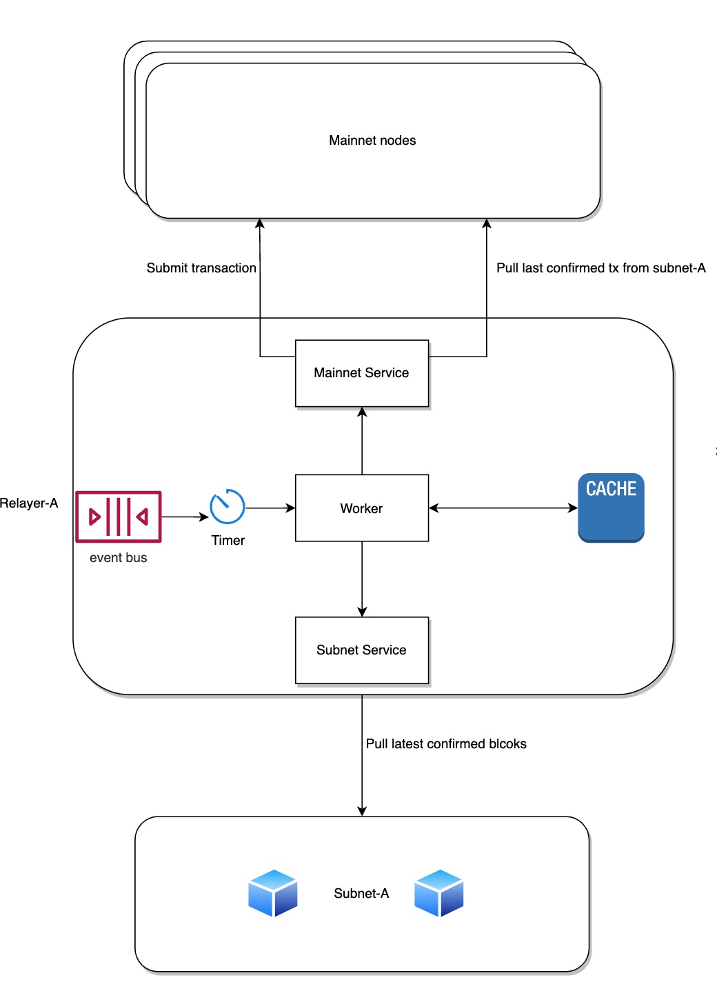

# Relayer

This section specifies the relayer that checkpoints the subnet chain to the parent chain.

## Design

### Background
There is a strong demand from the banking industry to adopt XDC. One of the key requirements to enter the field is the ability to support subnets so that banks are able to keep the sensitive transactions within their own domain (privacy concern) but at the same time, have the ability to continuously audit the result (hash) of the subnet transactions on the XDC mainnet (security concern).

Since the mainnet and subnets will be running as two independent node cluster, we will need to figure out a method to bridge them together to perform the auditing feature mentioned above. This is where “relayer” is coming into play.

### High-level architectural diagram
At high level, the relayer is able to:
1. Pull necessary data from both subnet and mainnet
2. Process and submit subnet block data as smart contract transactions into mainnet
3. When subnet masternodes list changes, report the new list and change height to the mainnet using grand-master account.

## Relayer Mode

There are 2 relayer modes 'Full' and 'Lite' where the default mode is 'Full'. In the full mode, all subnet block headers are checkpointed to the parent chain. In the lite mode, only the Epoch and Epoch gap subnet block headers are checkpointed in the parent chain (blocks 451,900,1351,1800, and so on). The Epoch and Epoch gap blocks stores important information regarding subnet validators selection. For further reading please check [Checkpoint Smart Contract](../components/checkpoint-contract.md).

### Choosing Full or Lite Relayer

The Full mode has the advantage of being more 'complete' and more 'current' as blocks are getting confirmed in the parent chain almost immediately. The Lite mode has the advantage of using lower parent chain gas fee as the Relayer is only submitting to once every 450 blocks.

### Deployment

In the deployment `RELAYER_MODE` config is only relevant for Checkpoint Smart Contract (CSC) deployment. The relayer itself is able to detect the CSC type automatically and push block headers accordingly.

