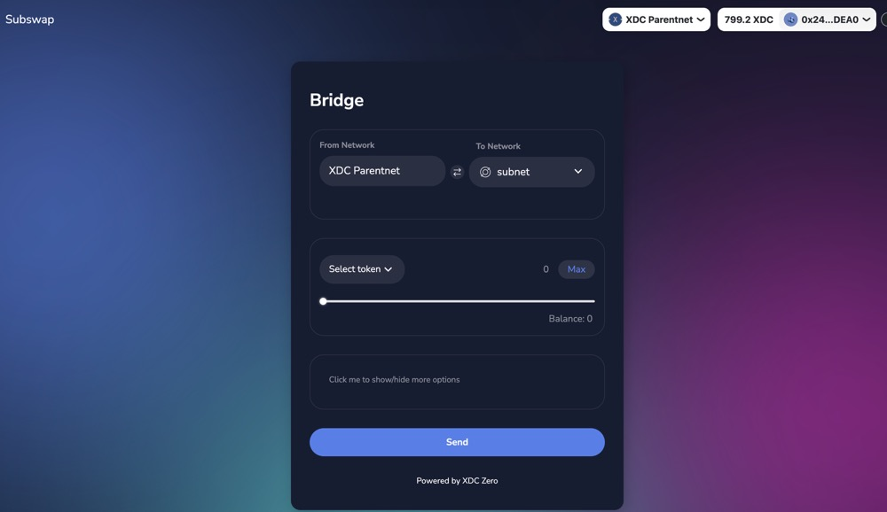
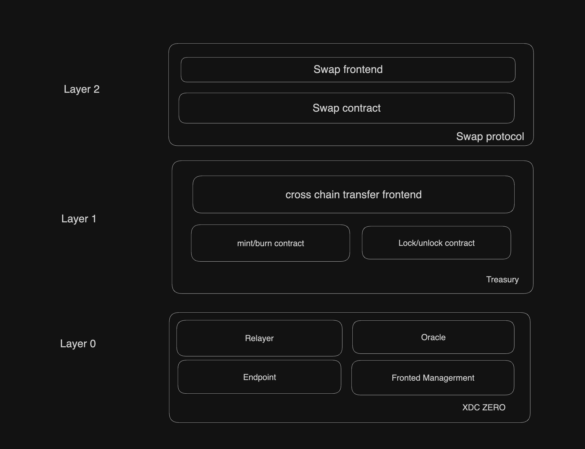

# Subswap

## Design

**Topic**: **Design of Subswap Cross-Chain Transfer System on XDC Zero**

---

Subswap is cross-chain application built on XDC Zero to provide seamless cross-chain transfer capabilities. It is structured in a multi-layered architecture, with each layer handling distinct functions to ensure smooth, secure, and efficient transactions across blockchain networks. This document provides a design overview of each layer, illustrating the components and their roles within the Subswap system.

---

### **System Architecture**

Subswap is organized into three layers:

1. **Layer 0 - XDC Zero (Core Infrastructure)**
   - **Relayer**: Manages the transfer of data and assets between blockchains by relaying transaction information across chains.
   - **Oracle**: Provides reliable and up-to-date data for cross-chain operations, ensuring that the transfer protocols operate with accurate information.
   - **Endpoint**: Serves as the core communication channel within XDC Zero, connecting the layers and ensuring transactions flow smoothly.
   - **Front-End Management**: Handles the user interface and manages interactions with the underlying protocols, offering a streamlined experience for users initiating cross-chain transfers.

2. **Layer 1 - Treasury**
   - **Cross-Chain Transfer Frontend**: User-facing interface for initiating and tracking cross-chain transactions. This frontend simplifies the user experience, making it easier for users to start transfers between different blockchains.
   - **Mint/Burn Contract**: Manages asset issuance and burning on different chains. This contract mints new assets on the target chain while burning them on the source chain, maintaining asset consistency across networks.
   - **Lock/Unlock Contract**: Locks assets on the source chain and unlocks them on the target chain, ensuring that the asset's total supply remains consistent and secure across chains.

3. **Layer 2 - Swap Protocol**
   - **Swap Frontend**: Provides a user-friendly interface for initiating swaps between different assets on the Subswap platform.
   - **Swap Contract**: Executes the swap logic, managing the conversion of assets based on the predefined terms and rates, ensuring that users receive the correct assets after a swap.

---

### **Design Considerations**

- **Security**: The use of locking and minting mechanisms prevents double-spending and ensures the security of cross-chain assets.
- **User Experience**: Frontends are designed to be intuitive, making it easy for users to interact with complex cross-chain protocols.
- **Reliability**: Oracles and relayers provide real-time data and reliable transaction relay, reducing the chance of errors in cross-chain transfers.

### **Conclusion**

Subswap leverages XDC Zero's powerful infrastructure to deliver an efficient cross-chain transfer service. By layering its architecture, Subswap can maintain security, scalability, and ease of use, meeting the needs of users looking for seamless asset transfers across multiple blockchain networks.

### Construction(if you want to make a cross chain transfer)

## Spec
### Subswap API Documentation
This document provides an API reference for the Subswap contracts, specifically for the `ParentnetTreasury` and `SubnetTreasury` contracts. These contracts facilitate cross-chain asset transfers by minting, burning, locking, and unlocking tokens between chains.

---

### **Restricted Access Functions**

#### **ParentnetTreasury**

1. **`changeEndpoint(address endpoint) -> void`**
   - **Description**: Allows the contract owner to set a new endpoint address.
   - **Parameters**:
     - `endpoint`: The address of the new endpoint.
   - **Access**: `onlyOwner`

2. **`setEndpoint(address endpoint) -> void`**
   - **Description**: Sets a new endpoint address, restricted to calls from the current endpoint.
   - **Parameters**:
     - `endpoint`: The address of the new endpoint.
   - **Access**: `onlyEndpoint`

3. **`mint(...) -> void`**
   - **Description**: Mints tokens on the `SubnetTreasury` chain in response to a cross-chain transfer.
   - **Parameters**:
     - `originalToken`: Address of the original token.
     - `name`: Name of the token.
     - `symbol`: Symbol of the token.
     - `account`: Address of the account receiving the minted tokens.
     - `amount`: Number of tokens to mint.
     - `sid`: Source chain ID.
   - **Access**: `onlyEndpoint`

#### **SubnetTreasury**

1. **`changeEndpoint(address endpoint) -> void`**
   - **Description**: Allows the contract owner to set a new endpoint address.
   - **Parameters**:
     - `endpoint`: The address of the new endpoint.
   - **Access**: `onlyOwner`

2. **`setEndpoint(address endpoint) -> void`**
   - **Description**: Sets a new endpoint address, restricted to calls from the current endpoint.
   - **Parameters**:
     - `endpoint`: The address of the new endpoint.
   - **Access**: `onlyEndpoint`

3. **`unlock(address token, uint256 amount, address recv) -> void`**
   - **Description**: Unlocks tokens on the current chain, sending them to the specified address.
   - **Parameters**:
     - `token`: Address of the token to unlock.
     - `amount`: Amount of tokens to unlock.
     - `recv`: Address of the recipient.
   - **Access**: `onlyEndpoint`

---

### **Public Functions**

#### **ParentnetTreasury**

1. **`burn(...) -> void`**
   - **Description**: Burns tokens on the `ParentnetTreasury` side to initiate a cross-chain transfer, sending a message to `SubnetTreasury` to mint tokens.
   - **Parameters**:
     - `rid`: Destination chain ID.
     - `rua`: Receiver’s address on the destination chain.
     - `originalToken`: Address of the original token on the source chain.
     - `token`: Address of the Treasury token to burn.
     - `amount`: Number of tokens to burn.
     - `recv`: Address to receive tokens on the destination chain.
   - **Events**:
     - Emits a `Burn` event with details of the burned amount and target chain.

2. **`test(uint256 rid, address rua, bytes memory data) -> void`**
   - **Description**: Sends arbitrary data to the specified chain via the endpoint, for testing purposes.
   - **Parameters**:
     - `rid`: Destination chain ID.
     - `rua`: Receiver’s address on the destination chain.
     - `data`: Encoded data to send.
  
3. **`getEndpoint() -> address`**
   - **Description**: Returns the current endpoint address.

#### **SubnetTreasury**

1. **`lock(...) -> void`**
   - **Description**: Locks tokens on the `SubnetTreasury` side to initiate a cross-chain transfer, sending a message to `ParentnetTreasury` to mint tokens.
   - **Parameters**:
     - `rid`: Destination chain ID.
     - `rua`: Receiver’s address on the destination chain.
     - `token`: Address of the token to lock.
     - `amount`: Amount of tokens to lock.
     - `recv`: Address to receive tokens on the destination chain.
   - **Events**:
     - Emits a `Lock` event with details of the locked amount and target chain.

2. **`getChainId() -> uint256`**
   - **Description**: Returns the chain ID of the current chain.
  
3. **`getEndpoint() -> address`**
   - **Description**: Returns the current endpoint address.

---

### **Algorithms and Rules**

#### **Minting and Burning**

- **Minting (ParentnetTreasury)**
  - When `SubnetTreasury` locks tokens on its chain, it sends a message to `ParentnetTreasury` to mint an equivalent amount on the destination chain.
  - If a Treasury token contract does not exist for the original token, a new one is created and mapped to the original token in `treasuryMapping`.

- **Burning (ParentnetTreasury)**
  - To initiate a cross-chain transfer back to the original chain, the `burn` function is called to destroy tokens on `ParentnetTreasury`. 
  - After burning, a message is sent to `SubnetTreasury` to unlock an equivalent amount on the destination chain.

#### **Locking and Unlocking**

- **Locking (SubnetTreasury)**
  - Tokens are locked on `SubnetTreasury` by transferring them from the caller’s address to the contract. 
  - The contract then sends a cross-chain message to `ParentnetTreasury` to mint equivalent tokens on the destination chain.

- **Unlocking (SubnetTreasury)**
  - In response to a burn action on `ParentnetTreasury`, the `SubnetTreasury` unlocks tokens on its chain and sends them to the specified recipient.

#### **Endpoint and Cross-Chain Communication**

- All cross-chain messages are handled through the `IEndpoint` interface, which abstracts the low-level cross-chain communication.
- Each function that initiates cross-chain actions (mint, burn, lock, unlock) encodes data using `abi.encodeWithSelector` to create a message payload, ensuring proper handling of contract-specific calls on the destination chain.
  
