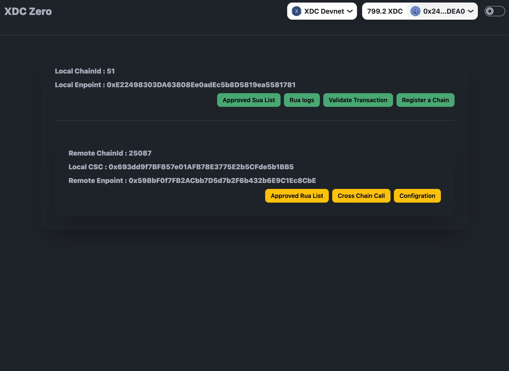
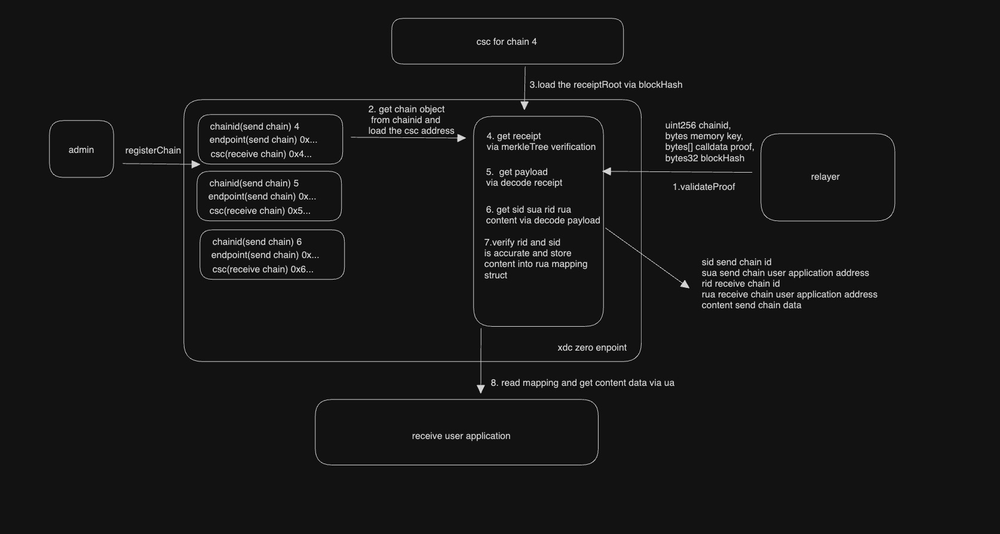
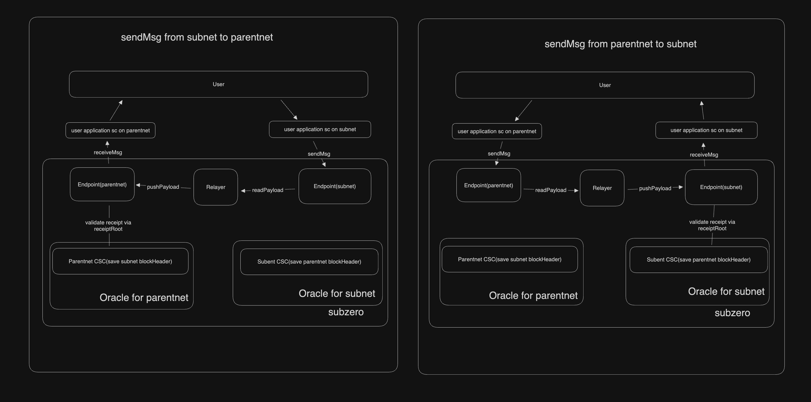

# XDCZero

## Design

XDC-Zero is a cross-chain framework that allows interoperability between XDC-Subnet and the XDC network. It ensures frictionless data transmission and rigorous validation across the Subnet and the Parentchain.

### Key Components

#### Oracle

Acting as the architectural keystone, the Oracle ensures the safe transfer of pivotal data, notably block headers, bridging source and target blockchains. Utilizing CSC contracts, the system guarantees not just steadfast data transfer but also the safeguarding of crucial block header details on the destination blockchain. Such functionalities affirm the data's integrity and coherence throughout chains.

#### Relayer

The Relayer functions as the essential conduit for transactional precision. Its core duty is to extract payload data from the source chain's Endpoint contract and channel it to the counterpart on the target chain. With this mechanism in place, XDC ZERO promises the exact and secure relay of transaction data, fostering efficient cross-chain synergies.

#### Endpoint

The XDC Zero Endpoint stands as the nexus for cross-chain communication, adeptly receiving and dispatching data packets across disparate blockchain networks. It offers indispensable services for the fluid operation of the cross-chain paradigm:

- **Data Reception & Dispatch**: The Endpoint ensures data packets, once received from a chain, are aptly relayed to another, directing data unerringly to its designated recipient.
- **Chain Integration**: The Endpoint facilitates the seamless onboarding of new blockchains into the system. By denoting unique identifiers and related contracts, it amalgamates new chains into the existing cross-chain communication matrix.
- **Transaction Authentication**: With the Endpoint's prowess, transactions undergo rigorous validation, certifying their authenticity before processing, thus bolstering system security against potential threats.
- **Payload Access**: The Endpoint offers a user-friendly interface for applications and entities to pull cross-chain payload data, an essential feature for apps dependent on inter-chain data streams.

At its core, the Endpoint functions as the orchestrator for all cross-chain data activities, ensuring data is meticulously received, processed, and channeled to its rightful destination.

#### Frontend

Experience a user-centric interface to manage the endpoint contracts spanning different chains. View the chain entities already synchronized with the current endpoint contract and effortlessly onboard new chain entities as per requirements.

### Endpoint workflow

### Workflow

## API Documentation
 {/* TODO:Spec? */}

### Restricted Access Functions

Functions accessible only by the contract owner or authorized clients.

1. **send(uint256 rid, address rua, bytes data)**

   - **Description:** Sends a packet to the designated receive chain.
   - **Parameters:**
     - `rid`: ID of the receive chain.
     - `rua`: Address of the receive application.
     - `data`: Data payload for the packet.

2. **validateTransactionProof(uint256 csid, bytes key, bytes[] calldata receiptProof, bytes[] calldata transactionProof, bytes32 blockHash)**

   - **Description:** Validates transaction and receipt proofs, ensuring secure cross-chain communication.
   - **Parameters:**
     - `csid`: ID of the send chain.
     - `key`: RLP key.
     - `receiptProof`: Proof data for the transaction receipt.
     - `transactionProof`: Proof data for the transaction.
     - `blockHash`: Hash of the relevant block.

3. **registerChain(uint256 chainId, IFullCheckpoint csc, Endpoint endpoint)**

   - **Description:** Registers a new chain for packet reception.
   - **Parameters:**
     - `chainId`: ID of the chain being registered.
     - `csc`: Checkpoint contract for the receive chain.
     - `endpoint`: Endpoint contract for the send chain.

4. **approveApplication(uint256 rid, address rua, address sua)**

   - **Description:** Approves both a receive and send application for cross-chain interaction.
   - **Parameters:**
     - `rid`: ID of the receive chain.
     - `rua`: Address of the receive application.
     - `sua`: Address of the send application.

5. **approveRua(uint256 rid, address rua)**

   - **Description:** Approves a receive application (rua) for a specific chain.
   - **Parameters:**
     - `rid`: ID of the receive chain.
     - `rua`: Address of the receive application.

6. **approveSua(address sua)**

   - **Description:** Approves a send application (sua) for packet sending.
   - **Parameters:**
     - `sua`: Address of the send application.

7. **revokeApplication(uint256 rid, address rua, address sua)**

   - **Description:** Revokes approval for both a receive and send application.
   - **Parameters:**
     - `rid`: ID of the receive chain.
     - `rua`: Address of the receive application.
     - `sua`: Address of the send application.

8. **revokeRua(uint256 rid, address rua)**

   - **Description:** Revokes approval for a specific receive application.
   - **Parameters:**
     - `rid`: ID of the receive chain.
     - `rua`: Address of the receive application.

9. **revokeSua(address sua)**
   - **Description:** Revokes approval for a send application.
   - **Parameters:**
     - `sua`: Address of the send application.

---

### Public Functions

Functions accessible by any user or contract on the blockchain.

1. **packetHash() returns (bytes32)**

   - **Description:** Retrieves the hash for the Packet event.

2. **getRlp(bytes memory key, bytes[] calldata proof, bytes32 root) returns (bytes memory)**

   - **Description:** Retrieves RLP data based on a Merkle Patricia proof.

3. **getFailureDataLength(uint256 rid) returns (uint256)**

   - **Description:** Retrieves the count of failed data entries for a specified receive chain.

4. **getReceiveChainLastIndex(uint256 chainId) returns (uint256)**

   - **Description:** Retrieves the last index for a specified receive chain.

5. **getSendChain(uint256 chainId) returns (Chain memory)**

   - **Description:** Retrieves details of a send chain based on its ID.

6. **getSendChainIds() returns (uint256[] memory)**

   - **Description:** Returns an array of all registered send chain IDs.

7. **allowanceRua(uint256 rid, address rua) returns (bool)**

   - **Description:** Checks if a receive application is approved for a specific chain.
   - **Parameters:**
     - `rid`: ID of the receive chain.
     - `rua`: Address of the receive application.

8. **allowanceSua(address sua) returns (bool)**
   - **Description:** Checks if a send application is approved.
   - **Parameters:**
     - `sua`: Address of the send application.

---

### Algorithms and Rules

- **Packet Validation:** Ensures that only approved applications on registered chains can send packets. The contract validates each transaction’s authenticity by verifying proofs of transaction and receipt.
- **Failure Data Handling:** If a packet transmission fails, the contract records it, allowing for potential retries or analysis.
- **Chain Registration:** Only authorized users (contract owner) can register new chains, safeguarding against unauthorized cross-chain communication.
