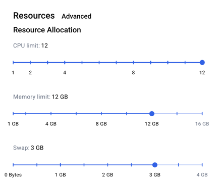

### Common Issues 
- **Subnet blocks are not being mined**.

    1. First confirm that the Subnet nodes are able to communicate with each other through the network layer. Run the check peer script `generated/scripts/check-peers.sh` the number of peers should be one less than number of subnet nodes. For example, if there are 3 Subnet nodes in total, each node should have 2 peers.

    2. If the nodes are peering but still not mining, it could be a low memory issue. In Docker configs you can try to increase memory or swap. Then, in case of fresh Subnet, [delete data and start the nodes again](../deployment-guide/launch-subnet.md). !

    3. Docker engine in Mac OS can be inconsistent after long-running or high-load. It could help to restart the machine and [hard reset the subnet](../deployment-guide/launch-subnet.md) to get it running.

- **Subnet node does not boot with error log `Fatal: Error starting protocol stack: listen unix /work/xdcchain/XDC.ipc: bind: invalid argument`**

    This is due to the volume mount path being too long. The mounth path is your current directory (also can check with `pwd` command). Please move the `generated` folder to a shorter path and try again.

- **Docker image startup fails with `SIGKILL` or `Error code: 137` found in logs. (Issue found in Frontend image)**

    This error occurs because Docker ran Out Of Memory (OOM). You can increase the memory limit in [Docker settings](https://docs.docker.com/desktop/settings/mac/#:~:text=lower%20the%20number.-,Memory,-.%20By%20default%2C%20Docker)

  

### Troubleshooting Scripts

  - `generated/scripts/check-mining.sh`

  This will check your current block in Subnet

  - `generated/scripts/check-peers.sh`
  
  This will check the number of peers of your Subnet node

### Telegram Troubleshooting Support Group
https://t.me/+jvkX6LaLEEthZWM1
