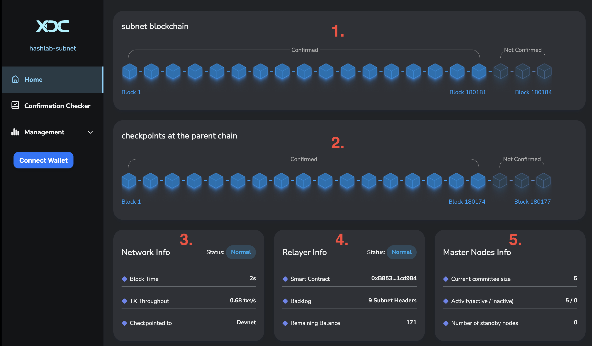

{/* TODO: same with XDC Subnet Official Documentation  */}
In the rapidly evolving landscape of blockchain technology, staying ahead of the curve is essential. One of the most intriguing advancements in the world of blockchain is the concept of blockchain subnets. In this comprehensive guide, we will dive deep into what blockchain subnets are, how they work, and why they are becoming a game-changer in the blockchain industry.

**What Are Blockchain Subnets?**  
Blockchain subnets are like specialized branches of a blockchain network. They allow you to create smaller, independent networks within a larger blockchain ecosystem. Think of them as self-contained mini-blockchains, each with its own unique features and functionalities. These subnets operate alongside the main blockchain but offer more flexibility and scalability.

**How Do Blockchain Subnets Work?**  
Blockchain subnets work by segregating the main blockchain into smaller, more manageable parts. This segmentation brings several advantages such as Scalability, Customization, Privacy and Security.

**Setting Up Your Own Blockchain Subnet**  
**[XDC Subnet](https://xinfin.org/xdc-subnet)** is a powerful technology that allows you to create a secure, scalable, and decentralized network within the XDC Ecosystem. It enables various use cases, including creating private subnets, deploying decentralized applications (DApps), and more. In this guide, we’ll walk you through the steps to set up your own XDC Subnet, opening doors to a world of possibilities.

**Step 1: Uninstall Old Versions**

Before you dive into setting up XDC Subnet, ensure that you don’t have any conflicting packages from previous installations. Run the following command to uninstall them:  

    for pkg in docker.io docker-doc docker-compose podman-docker containerd runc; do sudo apt-get remove $pkg; done
    

Enter fullscreen mode Exit fullscreen mode

**Step 2: Set Up the [Docker Repository](https://docs.docker.com/engine/install/ubuntu/#set-up-the-repository)**

To install Docker Engine, you need to set up the Docker repository. Follow these steps:

1.  Update the apt package index and install required packages:

    $ sudo apt-get update
    $ sudo apt-get install ca-certificates curl gnupg
    

Enter fullscreen mode Exit fullscreen mode

1.  Add Docker’s official GPG key:

    $ sudo install -m 0755 -d /etc/apt/keyrings
    $ curl -fsSL https://download.docker.com/linux/ubuntu/gpg | sudo gpg - dearmor -o /etc/apt/keyrings/docker.gpg
    $ sudo chmod a+r /etc/apt/keyrings/docker.gpg
    

Enter fullscreen mode Exit fullscreen mode

1.  Use the following command to set up the repository:

    $ echo \
    "deb [arch="$(dpkg - print-architecture)" signed-by=/etc/apt/keyrings/docker.gpg] https://download.docker.com/linux/ubuntu \
    "$(. /etc/os-release && echo "$VERSION_CODENAME")" stable" | \
    sudo tee /etc/apt/sources.list.d/docker.list > /dev/null
    

Enter fullscreen mode Exit fullscreen mode

1.  Update the apt package index again:

    $ sudo apt-get update
    

Enter fullscreen mode Exit fullscreen mode

**Step 3: [Install Docker Engine](https://docs.docker.com/engine/install/ubuntu/#install-docker-engine)**

1.  Now, you can install Docker Engine, containerd, and Docker Compose by running the following command:

    sudo apt-get install docker-ce docker-ce-cli containerd.io docker-buildx-plugin docker-compose-plugin
    
    

Enter fullscreen mode Exit fullscreen mode

1.  Verify the installation by running:

    $ sudo docker run hello-world
    

Enter fullscreen mode Exit fullscreen mode

1.  Update the apt package index & Test the installation.

    $ sudo apt-get update
    $ docker compose version
    

Enter fullscreen mode Exit fullscreen mode

Your Docker installation will be successfully completed using these steps!

With Docker set up, let’s move on to setting up XDC Subnet.
------------------------------------------------------------------------------------------------------------------------

**Step 4: Clone the Subnet Repository**

Clone the Subnet repository and change the directory:  

    git clone https://github.com/XinFinOrg/XinFin-Node.git
    cd XinFin-Node/subnet/deployment-generator/
    

Enter fullscreen mode Exit fullscreen mode

**Step 5: Create a Docker Environment File**

Create a docker.env file with parameters similar to docker.env.example, & make necessary configurations by entering below command.  

    cp docker.env.example docker.env
    

Enter fullscreen mode Exit fullscreen mode

Below is an example of the minimum file required for configs generation, **Update the below parameters with your data in the docker.env file.** Refer to check out in detail **[Config Explanation](https://xinfinorg.github.io/xdc-subnet-docs/deployment/configs_explanation/)**.

*   To check out exact config path, enter the following command:

    pwd
    

Enter fullscreen mode Exit fullscreen mode

*   If you don’t have any private key, You can create it using **[XDC Beta Web wallet](https://betawallet.xinfin.network/#/wallet/create/software?type=overview)** or else you can use **[XDCPay](https://chrome.google.com/webstore/detail/xdcpay/bocpokimicclpaiekenaeelehdjllofo)**.
    
*   For Devnet XDC, you can visit **[XDC Devnet Faucet](https://faucet.blocksscan.io/)**.
    

docekr.env file:  

    #deployment config
    CONFIG_PATH= /XinFin-Node/subnet/deployment-generator
    #subnet config
    NETWORK_NAME=testsubnet
    NUM_SUBNET=1
    NUM_MACHINE=3
    MAIN_IP=192.168.1.1
    #parentchain config
    PARENTCHAIN=devnet
    PARENTCHAIN_WALLET=0x0000000000000000000000000000000000000000
    PARENTCHAIN_WALLET_PK=0x0000000000000000000000000000000000000000000000000000000000000000
    

Enter fullscreen mode Exit fullscreen mode

**Step 6: Pull the Latest Subnet Generator Image**

Pull the latest Subnet Generator image with this command:  

    sudo docker pull xinfinorg/subnet-generator:latest
    

Enter fullscreen mode Exit fullscreen mode

**Step 7: Generate Configurations**

Generate configurations, this will create a new generated directory.  

    docker run --env-file docker.env -v $(pwd)/generated:/app/generated xinfinorg/subnet-generator:latest && cd generated
    
    

Enter fullscreen mode Exit fullscreen mode

Follow the generated instructions in **commands.txt** to start Subnet Nodes and make sure they are mining.

**Deploy subnet on machine1:**  

    docker compose - env-file docker-compose.env - profile machine1 pull
    docker compose - env-file docker-compose.env - profile machine1 up -d
    

Enter fullscreen mode Exit fullscreen mode

**Step 8: Deploy the Checkpoint Smart Contract**

Again, follow the generated instructions in **commands.txt** to **deploy the Checkpoint Smart Contract** to the “deployment-generator” folder.

Run “cd..” command to get back to the “deployment-generator” folder.  

    cd ~/.XinFin-Node/subnet/deployment-generator
    docker run --env-file docker.env \
        -v $(pwd)/generated/deployment.json:/app/generated/deployment.json \
        --entrypoint 'bash' xinfinorg/subnet-generator:latest ./deploy_csc.sh
    

Enter fullscreen mode Exit fullscreen mode

Execute the following command to deploy the **Checkpoint Smart Contract**:

This will provide you with the Checkpoint Smart Contract address (**checkpoint deployed to:**)

**Step 9: Deploy Subnet Services**

Follow the instructions in commands.txt to **deploy Subnet Services** (relayer, stats-server, frontend) to the “deployment-generator/generated” folder:  

    cd ~/.XinFin-Node/subnet/deployment-generator/generated
    docker compose --env-file docker-compose.env --profile services pull
    docker compose --env-file docker-compose.env --profile services up -d
    

Enter fullscreen mode Exit fullscreen mode

**Step 10: Check the Status**  

    docker ps -a
    

Enter fullscreen mode Exit fullscreen mode

**Step 11: Explore the Subnet UI**

Finally, explore the Subnet UI by accessing it at :5000.

Congratulations! You’ve successfully set up your XDC Subnet, enabling you to harness the full potential of XDC Network’s blockchain technology.

Checkout the guide for **[XDC Subnet user interface.](https://xinfinorg.github.io/xdc-subnet-docs/category/ui-usage-guide)**

Some Common Issues and Solutions:
----------------------------------------------------------------------

**Issue 1: Finding the System’s IP Address**

**Question:** If I do not have the private IP, where can I find the IP address of my system?

**Answer:** To determine your system’s IP address, use the following command:  

    ip a
    

Enter fullscreen mode Exit fullscreen mode

**Issue 2: Locating the Checkpoint Smart Contract Address**

**Question:** Where can I find the checkpoint smart contract address?

**Answer:** After executing the command below, you will obtain the “checkpoint smart contract address.” Please consult the “command.txt” file for the necessary commands.  

    cd ~/.XinFin-Node/subnet/deployment-generator
    docker run - env-file docker.env \
    -v $(pwd)/generated/deployment.json:/app/generated/deployment.json \
     - entrypoint 'bash' xinfinorg/subnet-generator:latest ./deploy_csc.sh
    

Enter fullscreen mode Exit fullscreen mode

**Issue 3: Resolving “No Such File or Directory” Errors**

**Question:** What should I do if I encounter the “no such file or directory” error repeatedly?

**Answer:** To address this, execute the command below to generate new configuration files. This will create a new directory to replace the existing one. Once you have the new directory, follow the subsequent steps as outlined in the “command.txt” file.  

    docker run - env-file docker.env -v $(pwd)/generated:/app/generated xinfinorg/subnet-generator:latest && cd generated
    

Enter fullscreen mode Exit fullscreen mode

**Issue 4: Determining the Exact Config Path for “docker.env”**

**Question:** How can I find the exact configuration path to update in the “docker.env” file?

**Answer:** To obtain the precise configuration path, use the “pwd” command, which will provide you with the necessary information.  

    pwd
    

Enter fullscreen mode Exit fullscreen mode

**Issue 5: Troubleshooting 'CSC Deployment Failed' Issue: Checkpoint Smart Contract Deployment**

**Question:** Encountering a "CSC deployment failed" issue during the deployment of the Checkpoint Smart Contract?

**Answer:** Please verify that the provided Private Key contains sufficient funds for both the Smart Contract deployment and subsequent transactions.

*   If you don’t have any private key, You can create it using **[XDC Beta Web wallet](https://betawallet.xinfin.network/#/wallet/create/software?type=overview)** or else you can use **[XDCPay](https://chrome.google.com/webstore/detail/xdcpay/bocpokimicclpaiekenaeelehdjllofo)**.
    
*   For Devnet XDC, you can visit **[XDC Devnet Faucet](https://faucet.blocksscan.io/)**.
    

Blockchain subnets represent a new frontier in blockchain technology. They offer the scalability, customization, and security needed to drive innovation across various industries. As blockchain subnets continue to gain momentum, staying informed about their capabilities and potential applications is crucial for anyone involved in blockchain development or adoption.

If you have any questions or need assistance, don’t hesitate to reach out to the XDC Network community on **[XDC.Dev](https://xdc.dev/)**. Start your XDC Subnet journey today!