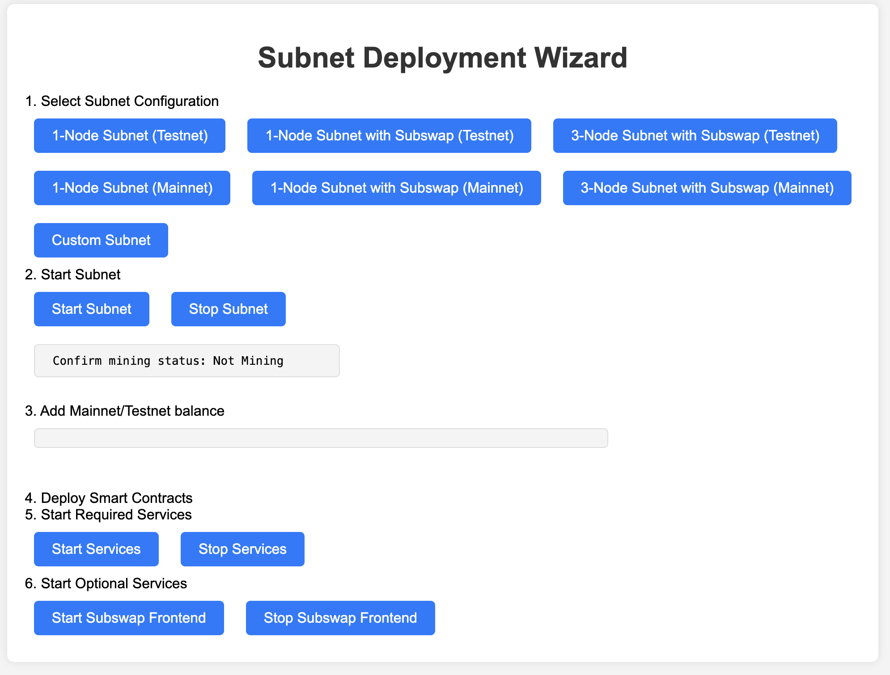
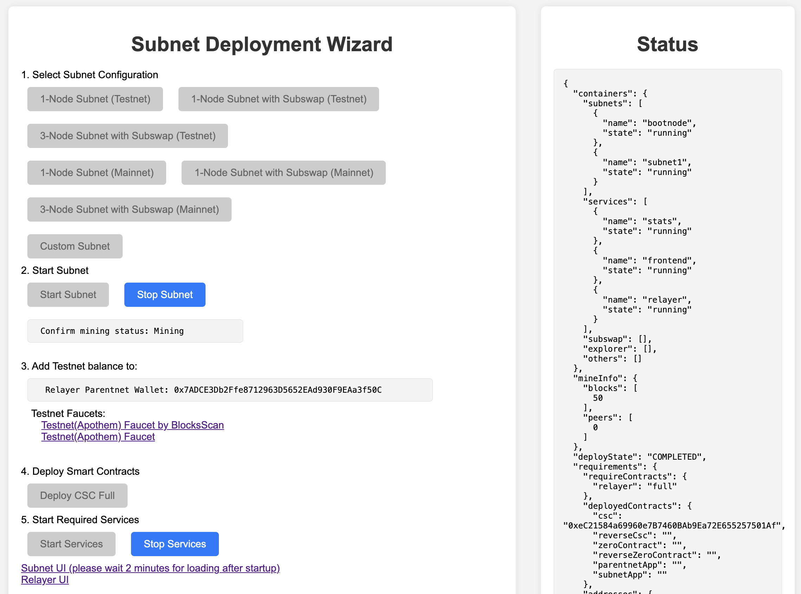

# Launch a Subnet in 10 Minutes

## Requirements
  - OS: Linux or Mac

  - docker and docker compose. For installation of docker compose please refer to: https://docs.docker.com/compose/install/linux/

  - Minimum Hardware Requirements:
    - Subnet Services:
        - CPU: 4 Core
        - Memory: 8 GB
        - Storage: 32 GB

    - Subnet Blockchain (per single Subnet node): 
        - CPU: 2 Core
        - Memory: 4 GB
        - Storage: 50 GB per year (takes up more space as blokchain grows)

  - Web3 wallet with funds. For testing we have testnet faucets:
    - https://faucet.apothem.network/ 
    - https://faucet.blocksscan.io/

## Video Walkthrough
<iframe width="768" height="432" src="https://www.youtube.com/embed/-SXsRbn6hN8" title="Setting Up Your Own XDC-Subnet Tutorial" frameborder="0" allow="accelerometer; autoplay; clipboard-write; encrypted-media; gyroscope; picture-in-picture; web-share" referrerpolicy="strict-origin-when-cross-origin" allowfullscreen></iframe>


## Deploy With Wizard UI

  1. Pull `start.sh` script from the generator Github repo and run. This will start a local webserver
  ```
  curl -O https://raw.githubusercontent.com/XinFinOrg/Subnet-Deployment/v2.0.0/container-manager/start.sh
  chmod +x start.sh
  ./start.sh
  ```
  
  2. Go to [http://localhost:5210/](http://localhost:5210) in your browser.
  <details>
  <summary>If you are running this on a remote server.</summary>
  <div>
    - if this is running on your server, first use ssh tunnel: <code>ssh -N -L localhost:5210:localhost:5210 USERNAME@IP_ADDRESS -i SERVER_KEY_FILE</code>
   <br /> 
    - if you are using VSCode Remote Explorer, ssh tunnel will be available by default
  </div>
  </details>

  3. Select one of the pre-defined configs or customize your Subnet.
  

  4. Follow the UI to finish the deployment, you can also check the Status monitor of your containers:
    - Start Subnet nodes
    - Deploy cross-chain contracts
    - Start Subnet services
  

  5. Once successfully deployed, you can check out [UI usage guide](../using-subnet/ui-usage-guide.md)
  
  {/* 6. (Optional) if you deployed Subswap, check out the usage here: */}

