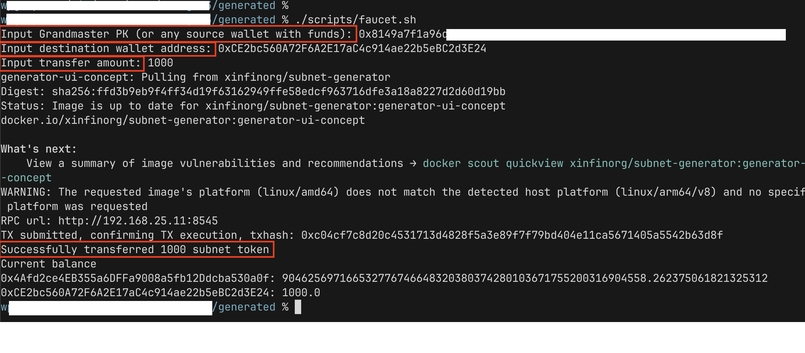
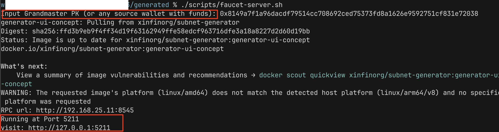
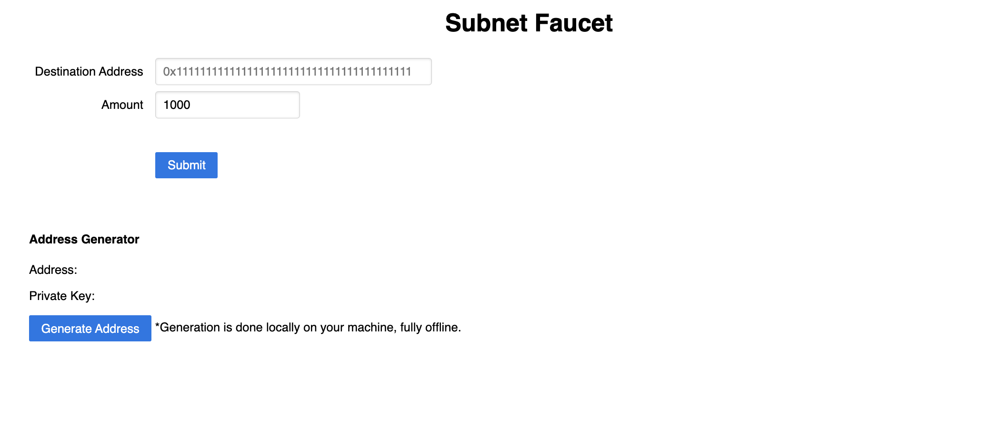
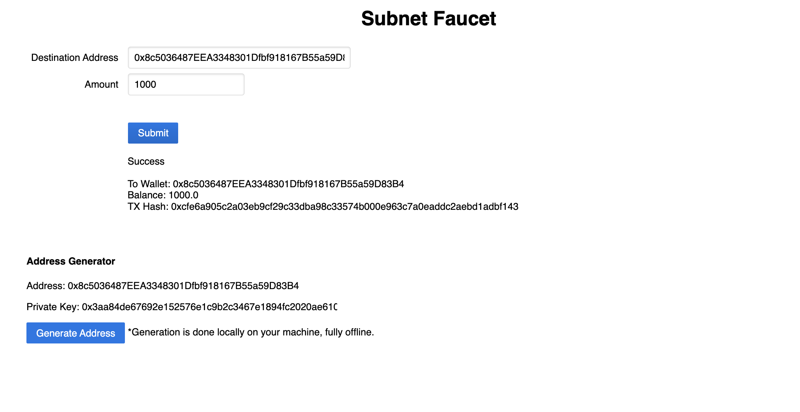

## Faucet

In Subnets, all native tokens are initially assigned to the Grandmaster Wallet. To allow users to use the Subnet, we have to distribute the tokens out of the Grandmaster. We have provided convenient scripts for you to easily share Subnet tokens to your users.

### One-time Transfer

Under `generated` directory run the Faucet script. 

```
./scripts/faucet.sh
```

The script will ask for your source wallet private key. You can use the Grandmaster Wallet(check `keys.json` file for the private key). 
Then input the destination wallet and the transfer amount.



### Faucet Server

Under `generated` directory run the Faucet server script.

```
./scripts/faucet-server.sh
```

The script will ask for your source wallet private key. you can use the Grandmaster Wallet(check `keys.json` for the private key).
By default, the server is hosted on port `5211` of your machine. Then, on your browser, visit the url: `http://127.0.0.1:5211`



Input your destination wallet or feel free to generate a random wallet via Address Generator.



Submit and wait for confirmation.



You can host this on any server and allow users to make token requests by themselves.

### Transfer Subnet Funds Without Faucet

The Faucet is not neccessary needed for funds transfer, most Ethereum compatible web3 wallet will also work. 

First import a new wallet with the Grandmaster private key. Then add a custom network pointing to your Subnet RPC URL. Finally, use the web3 wallet for tokens transfer.


### Faucet Source Code

Please feel free to check the below repositories for the Subnet Faucet source code.

https://github.com/XinFinOrg/Subnet-Deployment/tree/master/deployment-generator/scripts

https://github.com/XinFinOrg/Subnet-Deployment/tree/master/deployment-generator/src/faucet.js

