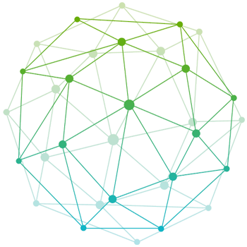

---

title: XDC Chain
sidebar_position: 1
description: "XDC Network is an enterprise-grade, EVM-compatible Layer 1 blockchain: fast settlement, near-zero fees, and XDPoS 2.0 consensus."
---

    

        <h1>XDC Chain</h1>
        
The XDC Network is a cutting-edge blockchain platform designed to revolutionize the way businesses manage and exchange data, assets, and financial records. Boasting impressive speed and scalability, the XDC Network is capable of handling a high volume of transactions with minimal delays, making it ideal for enterprise-level applications. Its low transaction fees further enhance its appeal, allowing businesses to conduct operations cost-effectively.

What truly sets the XDC Network apart is its military-grade security, ensuring that all data exchanges and asset transfers are protected against potential threats. This level of security is crucial for industries where trust and confidentiality are paramount. By leveraging the XDC Network, businesses can streamline their operations, improve record-keeping accuracy, and facilitate more efficient and secure data exchanges. Whether it's in finance, supply chain management, or trade, the XDC Network provides a robust and reliable infrastructure that empowers businesses to thrive in the digital age.

    

    

        
    

    {/* <a href="./developers/quick-guide" className="grid-item"> */}
    <a href="./developers/quick-guide" className="grid-item">
        
Developers

        
User guide to get started on XDC Chain

    </a>
    <a href="./governance/overview" className="grid-item">
        
Governance

        
XDC Network is a community-oriented ecosystem, meticulously built upon the foundation of decentralized governance.

    </a>
    <a href="https://xinfin.org/ecosystem-dapps">
        
XDC Ecosystem

        
XDC ecosystem and developer tools

    </a>
    <a href="./developers/node_operators/masternode">
        
Run a Masternode

        
How to run a XDC Masternode

    </a>
    <a href="./developers/rpc">
        
JSON-RPC-Endpoint

        
Interacting with XDC requires sending requests through a specific RPC.

    </a>

---

## Introduction
XinFin’s XDC Network is an enterprise-ready, Layer-1, EVM-compatible, open-source, hybrid blockchain protocol specializing in tokenization for real-world decentralized finance. It uses a special type of delegated proof-of-stake (XDPoS) for consensus to ensure quick transaction times, minimal gas fees, and a remarkable 2,000+ transactions per second (TPS).

XDC Network is backed by the XDC Community, leading to the formation of the XDC Foundation, which was established in 2021 to promote the growth and adoption of XDC through collaboration with a community of developers, trade experts, and content creators.

## XinFin Delegated Proof of Staked Authority
-
