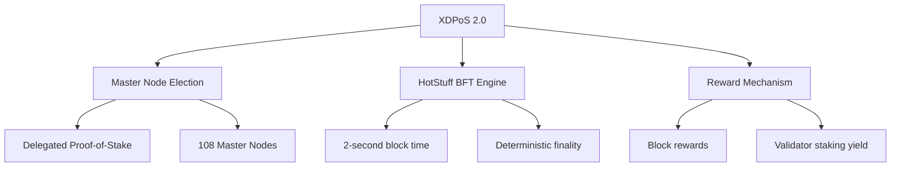

# XDPoS 2.0 Consensus

XDPoS 2.0 (XinFin Delegated Proof-of-Stake 2.0) is the consensus protocol at the heart of XDC Network. It delivers **2-second block finality** with Byzantine Fault Tolerance (BFT) while keeping the network energy-efficient and decentralized.

## Overview

XDPoS 2.0 is built on three pillars:



---

## Pillar 1 — Master Node Election

XDC Network is secured by **108 elected Master Nodes** chosen through a Delegated Proof-of-Stake (DPoS) mechanism.

### How Election Works

1. **Candidacy**: Any network participant with a minimum stake of **10,000,000 XDC** can register as a Master Node candidate.
2. **Delegation**: XDC holders delegate their tokens to candidates they trust. Voting power is proportional to delegated stake.
3. **Election**: The top 108 candidates by total delegated stake become active Master Nodes for each epoch.
4. **Epoch rotation**: The active set is re-evaluated at the start of every epoch (~900 blocks, ~30 minutes). Poor-performing nodes drop out and are replaced.

### Key Parameters

| Parameter | Value |
|-----------|-------|
| Active Master Nodes | 108 |
| Minimum candidate stake | 10,000,000 XDC |
| Epoch length | ~900 blocks (~30 min) |
| Block time | 2 seconds |
| Validator set update | Every epoch boundary |

### Slashing

Master Nodes that miss blocks or behave maliciously face:
- **Warning**: First offense — logged on-chain
- **Penalty**: Repeated offline behavior reduces priority in next election
- Future upgrades plan **stake slashing** for equivocation (signing two conflicting blocks)

---

## Pillar 2 — HotStuff BFT Consensus Engine

XDPoS 2.0 uses the **HotStuff** state-machine replication protocol as its consensus engine — the same algorithm used by Meta's Diem/Libra and Aptos.

### What is HotStuff?

HotStuff is a **Linear BFT protocol** that achieves:
- **O(n) message complexity** — each round requires only *n* messages (not n²), enabling efficient operation with 108 validators
- **Safety** in the presence of up to *f < n/3* Byzantine (malicious) nodes — up to 35 of 108 Master Nodes can fail without disrupting consensus
- **Liveness** as long as *2f + 1* honest nodes participate (at least 73 of 108)

### The Three-Phase Protocol

Each block requires three sequential voting phases before it is final:

```
Leader proposes block
        ↓
  Phase 1: PREPARE vote
  (108 validators sign the proposed block)
        ↓
  Phase 2: PRE-COMMIT vote
  (validators lock on the block)
        ↓
  Phase 3: COMMIT vote
  (block is irreversibly finalized)
        ↓
  Block appended to chain ✅
```

All three phases complete within the **2-second block window** because HotStuff's linear message complexity keeps communication overhead minimal.

### Finality Comparison

| Blockchain | Finality Time | Finality Type |
|------------|---------------|---------------|
| **XDC Network** | **~2 seconds** | **Deterministic (BFT)** |
| Ethereum | ~12–15 minutes | Probabilistic (PoS checkpoint) |
| Bitcoin | ~60 minutes | Probabilistic (6 confirmations) |
| Solana | ~0.4 seconds | Optimistic (reversion possible) |
| Polygon PoS | ~2–3 minutes | Checkpoint to Ethereum |

:::tip Why Deterministic Finality Matters
Unlike Ethereum where a transaction can theoretically be reorganized for minutes, XDC Network transactions are **irreversible within 2 seconds**. This is critical for trade finance, payments, and enterprise applications where settlement certainty is required.
:::

### The Forensic Monitor

XDPoS 2.0 includes a built-in **forensic monitoring layer** that:
- Tracks all validator votes and signatures cryptographically
- Detects equivocation (double-signing) attempts automatically
- Provides **cryptographic proof of misbehavior** that can be used for accountability
- Broadcasts evidence to the entire network for transparency

This is a significant security upgrade over XDPoS 1.0, which had no formal accountability mechanism.

---

## Pillar 3 — Reward Mechanism

### Block Rewards

Master Nodes earn XDC rewards for producing and validating blocks:

- The **block producer** (the Master Node proposing a block) earns the **base block reward**
- All 108 Master Nodes earn a **participation reward** for each epoch they actively participate in
- Rewards are distributed **on-chain automatically** at each epoch boundary

### Delegator Rewards

XDC holders who delegate to Master Nodes share in the rewards:
- Delegators receive a proportional share of the Master Node's total epoch reward
- The exact split between Master Node operator and delegators is configurable by each node operator
- Rewards are claimable at any time and accumulate on-chain

---

## XDPoS 2.0 vs XDPoS 1.0

| Feature | XDPoS 1.0 | XDPoS 2.0 |
|---------|-----------|-----------|
| Consensus | Round-robin + voting | HotStuff BFT |
| Finality | Soft finality | **Deterministic finality** |
| Message complexity | O(n²) | **O(n) linear** |
| Forensic monitoring | ❌ | ✅ |
| Double-sign detection | Manual | **Cryptographic proof** |
| Validator set size | 108 | 108 |

---

## Further Reading

- [XinFin XDPoS 2.0 Technical Paper](https://github.com/XinFinOrg/XDPoSChain/blob/master/consensus/XDPoS_v2.md)
- [HotStuff Protocol — original paper](https://arxiv.org/abs/1803.05069)
- [Node Operators Guide](/docs/xdc-chain/developers/node-operators/masternode)
- [XDC Architecture](/docs/learn/xdc-architecture)